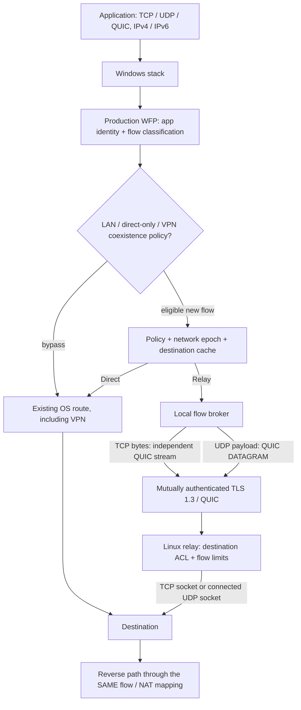

# NetworkRoute Optimizer — architecture

Status: design for production, with an incremental, executable MVP. The repository was empty on initial inspection. No existing networking stack or application is being replaced.

## 1. Contract and scope

**Updated requirement: free standalone operation is the default.** Smart must start without a relay, identity, subscription or VPS. It races up to eight resolved TCP endpoints, interleaves IPv4/IPv6 and staggers attempts by 250 ms; losing sockets carry no application bytes. Direct measurements report endpoint/family setup times, never claim equal-destination alternate ISP routing. Existing OS/VPN routes remain authoritative. The relay architecture below is an optional extension only; no paid infrastructure or anonymous public proxy list is required. Without another available path, the engine retains native connectivity. Reference: [RFC 8305](https://www.rfc-editor.org/rfc/rfc8305).

Measure → compare → decide → route → monitor → adapt. Direct means **the operating system's existing egress**, including an installed VPN, proxy-independent route, or split tunnel. Direct does not mean bypassing somebody else's VPN. No TLS interception, payload logging, registry booster tweaks, DNS replacement, or blanket default-route replacement.

The first deliverable is an explicit SOCKS5 data plane: selected applications that support SOCKS can use real TCP forwarding and UDP associations through an authenticated QUIC relay. It proves the transport, measurements, policy and failure behavior without installing a kernel driver. It is **not yet transparent system-wide or arbitrary-executable routing**. Unsupported commands/modes must fail explicitly, never pretend to optimize traffic.

Transparent application/system interception is a subsequent release gate, requiring a signed, tested WFP callout. A Windows service, restricted IPC and UI follow the working data plane. Do not ship unsigned/test-signed drivers as a consumer installation workaround.

## 2. Stack decision

| Component | Choice | Reason / tradeoff |
|---|---|---|
| Client engine and Linux relay | Go, shared modules | Memory safety, mature quic-go streams **and datagrams**, portable single binaries, Windows IP Helper access through x/sys. GC and allocations require explicit budgets and profiling. |
| Alternative | Rust + Tokio + Quinn | Excellent hot-path control; preferred if Go packet/GC profiling misses budgets. More FFI/build/toolchain work for this first verifiable vertical slice. Keep wire protocol independent of language. |
| Production interception | Minimal WFP callout in WDK-supported C/C++, service policy in Go | Official process-aware hooks; no injection into applications. Driver does only bounded classification, flow lookup and reinjection. |
| Optional full-IP adapter | Signed Wintun distribution | Useful later for system/tunnel mode; not a substitute for process attribution or per-process policy. Review redistribution license. |
| Production UI | WPF on supported .NET LTS | Native Windows UI, separate unelevated process; no bundled browser engine needed. Implement after data plane acceptance. |
| IPC | Windows named pipe, explicit DACL and client identity checks | Read access for authorized users; administrative policy changes require separate authorization. Never expose privileged control on an unauthenticated HTTP port. |
| Config | Versioned JSON in MVP | Standard-library strict decoding; no executable configuration. Can add TOML frontend without changing policy types. |

Go is a deliberate deviation from the preferred Rust option, not a claim of superior packet performance. Production budgets are targets, not measured achievements.

## 3. WFP vs TUN vs hybrid

| Approach | Per-process policy | Data plane cost | Compatibility / deployment |
|---|---|---|---|
| WFP | ALE app identity, PID, flow context | Direct packets stay in kernel; selected TCP is redirected to local broker, UDP requires bounded callout/reinjection | Official API; custom callout signing, HVCI and driver testing required. Coexistence with other WFP providers must be tested. |
| Wintun/TUN alone | IP packets contain no PID; IP Helper snapshots are incomplete and race-prone | Every captured packet crosses userspace; direct reinjection also needs a correct path | Signed adapter available; routes/MTU/VPN conflicts and a userspace IP stack or raw tunnel still need solving. |
| Hybrid WFP + TUN | WFP supplies authoritative flow ownership | Adds adapter and state synchronization to WFP costs | Appropriate for a future full-IP mode; not automatically simpler or lower latency. Standard IP routes cannot select two processes with the same destination. |

**Production choice: WFP-first flow steering with the shared QUIC relay broker.** Optional TUN backend is isolated behind a `CaptureBackend` contract, not mandatory in the first production path. TCP uses ALE connect redirect and the documented redirect-context/record IOCTLs. UDP needs a separate datagram callout path with flow lifetime, original destination, checksums, asynchronous injection, loop prevention and bounded queues. The Microsoft connected-UDP redirect caveat precludes pretending TCP redirection alone covers arbitrary UDP.

Unselected flows, LAN traffic and excluded applications remain native. Classification cannot label UDP as gaming or UDP/443 definitively as QUIC: use an explicit profile or AUTO=INTERACTIVE until observed rate/burst/duration metadata provides sufficient evidence. No encrypted payload inspection is needed.

## 4. Packet and connection flow



MVP replaces `Stack → Capture` with an application's explicit loopback SOCKS5 connection. TCP CONNECT carries the requested address; UDP ASSOCIATE binds a UDP endpoint to the lifetime of the TCP control connection. There is no HTTP/TLS parsing and no HTTP CONNECT downgrade. Proxy choice is explicit and not written into system configuration.

## 5. Ownership and monitoring

Use `GetExtendedTcpTable` for IPv4/IPv6 owner-PID TCP rows. Use `GetExtendedUdpTable` for owner-PID **local endpoints only**: it does not expose remote UDP destinations. Show unknown rather than invent them. Query executable paths with `PROCESS_QUERY_LIMITED_INFORMATION`; inaccessible processes retain PID and an explicit unavailable path. PID reuse means attribution also needs creation-time identity in production. A snapshot is diagnostic, not an enforcement authority.

WFP ALE application ID plus per-flow context supplies enforcement identity. ETW is supplemental diagnostics/measurement, not a guaranteed packet ownership source; events can be lost. Network List Manager and IP Helper change notifications invalidate the network epoch. A reconnect, address/interface/gateway change, VPN transition and sleep/resume invalidate path quality estimates. Existing sessions remain pinned; new decisions use the new epoch.

## 6. Tunnel and Linux relay

One authenticated QUIC connection per relay/client session. No 0-RTT forwarding. TLS 1.3 using standard libraries, certificate public-key pins in MVP, mutual client authentication. Private keys are local credentials and never appear in logs or example configs. Pinning replaces public PKI validation only for configured self-hosted certificates; expiry and the expected public key are checked. Production adds rotation/revocation and OS protected key storage.

TCP: one bidirectional QUIC stream per destination connection. A bounded versioned header is followed by an explicit success/error response; only then forward opaque bytes. Preserve TCP half-close. Never replay application bytes after a failed relay. QUIC streams isolate loss between flows, while sharing congestion control; many bulk streams can still harm realtime traffic and need transport separation/quotas later.

UDP: control stream establishes a fixed destination flow ID; unordered QUIC DATAGRAM frames carry `(flow ID, message ID, fragment index/count, bytes)`. No reliable stream fallback for UDP. Flow IDs are scoped to authenticated connection. Each relay flow has a connected UDP socket, so unrelated senders cannot inject replies. Original payloads up to 65507 bytes are split into 1000-byte application fragments; bounded reassembly emits only complete original datagrams. A missing fragment loses the datagram, without retransmission. This accommodates inner 1200-byte QUIC Initial packets without forcing IP fragmentation of the outer tunnel. Exceeding the limit is rejected/counted. Full-IP capture later needs ICMP Packet Too Big, IPv6 minimum-MTU and MSS/PMTUD tests; SOCKS does not expose full IP packets and cannot claim to implement those mechanisms.

Relay validates the actual resolved destination before dialing and uses that same numeric address (DNS rebinding defense). Default deny loopback, private, link-local, multicast, reserved/documentation ranges, cloud metadata and relay-local addresses. Configurable destination/port policy, bounded clients/flows, handshake timeouts, idle UDP expiry and egress firewall are required against authenticated abuse. It is never an open unauthenticated proxy. The relay can observe destination and unencrypted application traffic; tunnel encryption does not replace destination TLS.

## 7. Route measurement

Compare **the same numeric destination, port, protocol, family, network epoch and probe type**. Cache keys cannot be hostname-only or ASN-only. DNS/CDN experiments are a separate dimension; comparing two different endpoints must be labelled as such.

For TCP the MVP measures client-observed time to successful destination connect: native connect versus warm QUIC stream request + relay destination connect + response. This includes the full relay control path, not just relay RTT. Record cold QUIC establishment separately. This is **TCP connection establishment**, not packet RTT, TLS time, TTFB, throughput or UDP loss. Do not fill unknown metrics with zero. Alternate/randomize probe order; cap frequency/concurrency, samples and destination count. No payload probes to arbitrary UDP services. UDP full-path quality requires a cooperating echo endpoint or application-visible passive measurements; otherwise keep Direct in Smart mode.

Future benchmark runner: endpoint-controlled TCP/TLS/HTTP/UDP echo targets; p50/p95/p99 RTT, adjacent-success jitter, missing responses, handshake/TLS/TTFB, explicitly user-started throughput. TLS/HTTP measurements retain normal certificate validation. Distinguish refusal, timeout, DNS failure and access denial. ICMP is a separate diagnostic, never a universal loss estimator for applications. Bufferbloat compares idle vs separately labelled upload-loaded/download-loaded latency; no unattended bandwidth saturation.

## 8. Route Decision Engine

Key: `(network epoch, numeric destination, port, protocol, traffic profile)`. Entry: bounded observations, sample time, p50/p95/p99, min, variation, failed-connect fraction, optional true packet loss and throughput, confidence, preferred route, candidate-since, last-switch, expiry. Cache has capacity and TTL; no unbounded destination history. ASN/CIDR/domain knowledge is only a prior, not proof that another destination has the same path.

Score in millisecond-equivalent units:

`median + jitterWeight*jitter + tailWeight*(p95-median) + failureWeight*failedFraction + optional throughput penalty`.

REALTIME weights loss/tails highest; INTERACTIVE emphasizes setup/tails; STREAMING and BULK require actual throughput before a throughput-optimization claim. AUTO starts INTERACTIVE. Unknown packet loss/throughput remains unknown. Sample confidence and freshness gate switching; a low score without sufficient samples is not evidence.

Retain Direct unless the candidate beats both an absolute threshold (initial 5 ms) and relative threshold (15%), remains better for at least 10 s over multiple windows and meets minimum samples. Minimum selected-route lifetime/cooldown initially 30 s. Expire observations after network changes. A relay outage opens its circuit breaker immediately for **new** flows. Re-test with bounded backoff; do not probe every packet or every HTTP request. Route selection runs once per flow; packets use pinned forwarding state.

## 9. Failure semantics and VPN coexistence

TCP and stateful UDP are sticky for their lifetime. Relay failure cannot transparently preserve established TCP/NAT sessions when egress IP changes. Close the affected connection, let the application reconnect, and select Direct for new connections in fail-open mode. Retry only before application payload is sent. Fail-closed is explicit policy and never silently falls back; production persistent blocking filters must have an independent administrative recovery path.

MVP changes no adapter, routes, firewall or system DNS. Thus it composes with the existing OS egress and cannot strand system routing after a crash. An application explicitly configured to use a dead SOCKS proxy still needs its proxy disabled or the broker restarted: **MVP does not promise system-service-crash fail-open**.

Production uses owned GUIDs, WFP transactions and dynamic-session filters for fail-open capture; filters are removed on engine-session closure. Never delete another provider's filters. Redirected established flows can still fail. A service watchdog leases forwarding health and removes only owned capture on timeout; SCM recovery restarts service. Durable versioned journal records any optional adapter/route changes before mutation and validates ownership/current value on rollback. Startup reconciles incomplete transactions. Fail-closed persistent filters are a separate explicit installation option, not dynamic fail-open filters.

VPN detection is advisory (adapter type, routes, DNS/NRPT, proxy state, known tunnel interfaces), never based solely on process names. Respect existing kill switches. Default do not tunnel inside/around another VPN automatically; offer diagnostics/direct-only or explicit nested-tunnel mode. Do not race more-specific routes against WARP/Tailscale/WireGuard. Unknown WFP provider coexistence is a compatibility-test requirement, not a promise of universal support.

## 10. Modules and privileges

```
cmd/networkroute/       CLI and explicit proxy host
cmd/nr-relay/           Linux relay entry point
internal/config/       strict configuration and validation
internal/identity/     TLS identities and public-key pins
internal/protocol/     versioned bounded framing
internal/tunnel/       QUIC client/server and UDP associations
internal/policy/       destinations, exclusions, profiles
internal/quality/      measurement, scoring, hysteresis, cache
internal/proxy/        SOCKS5 TCP + UDP data plane
internal/monitor/      IP Helper and platform diagnostics
internal/metrics/      counters; no payloads
docs/                  deployment, benchmarks, security, roadmap
tools/                 reproducible build and dev network simulation
```

Future capture/service/IPC/UI remain separate modules. MVP CLI and explicit proxy need no administrator. Driver/service installation will require administrator; GUI must not. Service config/keys ACL: SYSTEM + administrators; user read-only status via named pipe DACL. IPC requests validate token/session and bounded schema; no shell-command RPC. Logs: structured severity, metadata only, destination logging opt-in; no keys/tokens/cookies/payload. No mandatory analytics or external ASN lookup.

## 11. Performance and release gates

Targets to measure on documented hardware: idle <1% CPU, typical active <3–5%, working set <200 MB; per-packet internal processing well below 1 ms excluding crypto/network scheduling. No claims until measured. Bound all queues, flows, goroutines, probes, frame lengths and caches. No DNS, process queries or scoring in packet hot path. Pool buffers only after profiles justify it. QUIC encryption and congestion control are not free.

Testing: score/hysteresis/freshness simulations; parser fuzzing; mutual-auth rejection; SSRF/DNS rebinding; TCP half-close; binary payload integrity; UDP/no-TCP-fallback; relay failure; IPv6; oversized frames/datagrams; timeout/cancel cleanup; race detector; Windows API smoke tests. Linux netem fixture for delay/loss/jitter/rate; explicit namespace only, never host default qdisc. Windows 10/11 x64/ARM64 runtime matrix, VPN coexistence, HVCI, sleep/resume and driver verifier are later release gates.

## 12. Implementation plan

1. **Research/design:** this document, official API references, explicit MVP gaps.
2. **Monitor:** IPv4/IPv6 TCP ownership + UDP local endpoints, process paths, interfaces; tests for binary table parsing.
3. **Relay:** mTLS QUIC listener, destination policy, resource limits, testable local integration endpoints.
4. **Tunnel:** TCP streams + UDP datagrams, versioned handshake, cancellation/half-close, pins, no plaintext fallback.
5. **Selected applications MVP:** loopback SOCKS5 with explicit app configuration; DIRECT/SMART/RELAY policy and Direct Only exclusions. Transparent executable routing is a later WFP milestone.
6. **Measurement:** bounded alternating direct/relay destination-connect probes with honest metric names and unknown fields.
7. **Decision:** profiles, hysteresis/cooldown/confidence, bounded expiring cache and network epoch.
8. **Automatic decisions:** pin new flows, fallback before payload, invalidate unhealthy route and remeasure; UDP remains Direct without comparable evidence unless explicitly selected.
9. **UI/service:** first expose actual CLI results; then restricted named-pipe service and WPF GUI, no fabricated counters.
10. **Diagnostics:** route/interface/DNS/MTU snapshot, network changes, reproducible reports and privacy controls.
11. **Bufferbloat/QoS:** opt-in controlled tests, SQM recommendations, local bounded scheduling; optional DSCP with measured effectiveness. No automatic router edits.
12. **Multi-relay:** discovery authenticity, relay health/load, rate-limited tournaments; keep self-hosting entirely local.
13. **Transparent production/security:** signed WFP driver, transactions/watchdog, fail-closed lifecycle, VPN coexistence matrix, credential protection and audit.
14. **Performance:** benchmark Windows capture + tunnel, CPU/GC/queue profiles; consider Rust for demonstrated bottlenecks. Multipath/redundancy remain disabled research requiring common egress deduplication; sending arbitrary UDP twice to a destination is not safe.

Completion is tracked in README against running code. Planned architecture must never be presented as already implemented.

## Console release boundary (0.4.0)

The independent Windows EXE embeds manuals and a compressed Linux deployment kit through Go embed. With no arguments it runs the persistent `internal/console` menu; existing scriptable CLI commands remain. `internal/engine` owns the listener, cancellation, network-change monitoring and flow shutdown for both interfaces. No elevated UI or external runtime is required. Settings live in LOCALAPPDATA or an explicit data directory; `internal/storage` validates temporary protected files before atomic replacement. The console displays actual counters and connection measurements. Exporting the server kit does not deploy it, and generating a WireGuard profile does not install its separate official driver. This release does not turn the planned WFP/service phases into implemented features.

## Primary references

- Microsoft [WFP connect/bind redirection](https://learn.microsoft.com/en-us/windows-hardware/drivers/network/using-bind-or-connect-redirection) and [redirect records](https://learn.microsoft.com/en-us/windows/win32/winsock/sio-set-wfp-connection-redirect-records).
- Microsoft [connected UDP redirection limitation](https://learn.microsoft.com/en-us/troubleshoot/windows-hardware/drivers/redirection-connected-udp-traffic-local-proxy-fail), [UDP flow lifetime](https://learn.microsoft.com/en-us/windows/win32/fwp/udp-packet-flows), [UDP owner row](https://learn.microsoft.com/en-us/windows/win32/api/udpmib/ns-udpmib-mib_udprow_owner_pid).
- [Wintun official interface and distribution](https://www.wintun.net/).
- [quic-go datagrams](https://quic-go.net/docs/quic/datagrams/) and [streams](https://quic-go.net/docs/quic/streams/).
- [QUIC DATAGRAM RFC 9221](https://www.rfc-editor.org/rfc/rfc9221), [QUIC RFC 9000](https://www.rfc-editor.org/rfc/rfc9000), [SOCKS5 RFC 1928](https://www.rfc-editor.org/rfc/rfc1928).
- [OpenWrt SQM](https://openwrt.org/docs/guide-user/network/traffic-shaping/sqm): controls queueing under load, not physical propagation latency.
